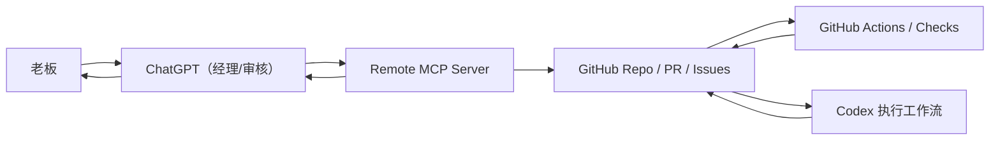

# MCP 架构说明

## 目标

把 ChatGPT 直接连接到 GitHub 仓库现场，让它能读取 PR、diff、checks、测试摘要和关键文件，并在需要时把审核意见写回 PR 评论。

## 组件关系

- ChatGPT：通过 developer mode 连接 remote MCP server。
- MCP server：对 GitHub REST API 做最小封装，输出适合 ChatGPT 消费的结构化 JSON。
- GitHub：承载仓库、PR、issue、review、Actions、checks。
- CI：通过 GitHub Actions 产出 lint / build / typecheck / test 结果。
- Codex：在 PR 上执行任务、提交改动、配合 review workflow。

## 工具清单

第一版暴露以下 MCP tools：

- `get_repo_status`
- `list_open_prs`
- `get_pr`
- `get_pr_diff`
- `list_changed_files`
- `read_file`
- `get_checks`
- `get_test_summary`
- `review_pr`
- `request_changes`
- `list_recent_commits`
- `get_issue`
- `post_pr_comment`

## 数据流

1. ChatGPT 调用 `get_pr` / `get_pr_diff` / `list_changed_files` 读取 PR 事实。
2. ChatGPT 调用 `read_file` 读取 `AGENTS.md`、关键实现文件或模板。
3. ChatGPT 调用 `get_checks` 和 `get_test_summary` 读取 CI 状态与测试摘要。
4. ChatGPT 调用 `review_pr` 生成结构化审核意见。
5. 若需返工，ChatGPT 调用 `request_changes` 生成返工单，再用 `post_pr_comment` 回写到 PR。

## 审核流

1. 获取老板目标或 issue 背景。
2. 获取 PR 元数据、文件列表和 diff。
3. 读取 `AGENTS.md` 与相关文档。
4. 读取 checks、测试摘要和失败详情。
5. 输出结构化审核结论。

## 命令流

- 老板只对 ChatGPT 发自然语言。
- ChatGPT 给 Codex 的指令必须落到 issue/PR 评论、模板或工单文件。
- Codex 在 GitHub workflow 或本地执行任务。
- 执行结果通过 PR、checks、评论回到 GitHub，再由 MCP 暴露给 ChatGPT。

## 权限模型

- 默认只读：读取 repo、PR、issue、files、checks、workflow artifacts。
- 最小写集：仅允许 `post_pr_comment`。
- 仓库边界：只允许访问 `GITHUB_REPOSITORY` 或 `MCP_ALLOWED_REPOS` 中声明的仓库。
- 安全原则：不执行任意 shell，不暴露 secrets，不代理到无关仓库。

## 部署方式

- 最小实现：`FastAPI` 单服务，使用 Streamable HTTP JSON-RPC 暴露 `/mcp`。
- 运行方式：`uvicorn server:app --app-dir mcp-server --host 0.0.0.0 --port 8080`
- 反向代理：可挂在 Nginx、Caddy、Cloud Run、Render、Fly.io 或容器平台后。

## 风险与限制

- 当前实现依赖 GitHub token 权限；权限不足时只能读取部分字段。
- 当前仓库未定义 coverage 命令，因此只返回“coverage unavailable”与后续建议。
- `review_pr` 是规则型审核，不替代 ChatGPT 对业务目标与视觉质量的最终判断。
- 由于本地工作区缺少 `.git` 元数据，本次交付只能保证工作流可部署和可测，不能在当前副本里直接创建真实 PR。
